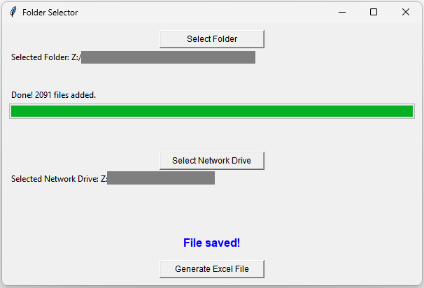

# Full File Paths

This tool helps generate an Excel file that displays all the full paths of files stored on a Network Drive, along with the total length of each respective file path.

### The Problem

1. Windows has a character limit of 260 for file paths. File paths that exceed this limit do not open or encounter issues. This is caused due to long file/folder names, and deep folder structure nesting.
2. Network Drives use a temporary placeholder character (e.g. "Z:") to indicate the drive in the file path, but is replaced with the actual Network Drive location path once the file is open. This causes filepaths that seem to be well under this limit, to exceed it without clear indication.

### The Solution

This tool will help you list all the files under a specificed Network Drive, list all the full file paths (including the real Network Drive location), and display a character count indicating its length. You can then rename files and folders that exceed this limit manually.

Below is a snippet of the output Excel file where the grayed out region are file paths, and the column to the right are lengths that are automatically highlighted right if >= 260 characters.

## How to Use:

1. Select actual folder stored on Network Drive
2. Wait for program to scan entire folder
3. Select Network Drive itself
4. Click Generate Excel File
5. Select save location
6. Wait for file to save, then inspect all file paths in Excel manually and rename as preferred
